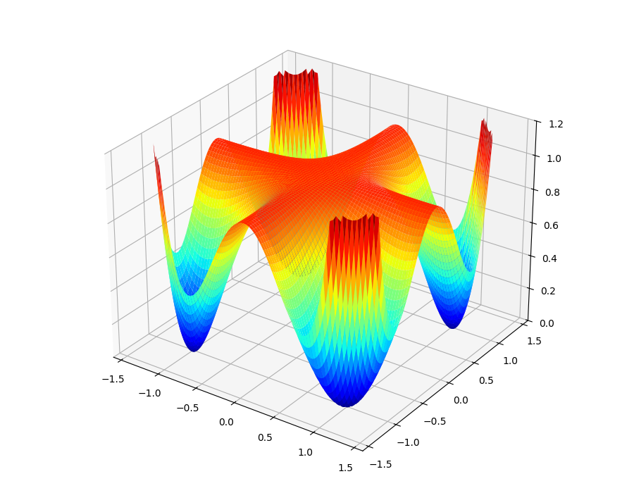
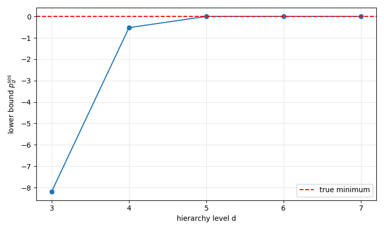
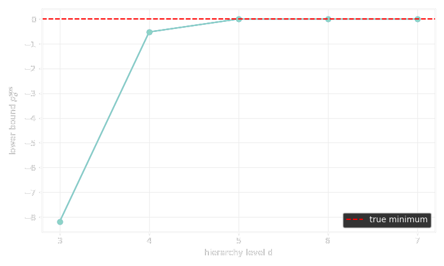

## Non-negativity and sums of squares

Let $\R[x]$ be the polynomial ring in variables $x = (x_1, \dots, x_n)$ with real coefficients.
We start with the following lead problem:
decide whether a given polynomial $p \in \R[x]$ defines
a globally non-negative function (in short, $p \geq 0$).
While we expect this to be very hard to solve in general,
we may consider some special cases of polynomials.

> **Example (Univariate case)**:
> Let $n = 1$ and assume that $p \in \R[x]$ is non-negative.
> Necessarily, we must have that $\deg(p) = 2d$ is even,
> and that the leading coefficient of $p$ is positive
> (we might as well take $p$ monic).
> We also note that any real root $p$ might have must appear with
> even multiplicity as $p$ otherwise flip sign there.
> Consider a factorization of $p$ into real roots and complex
> conjugate root pairs:
> $$\begin{aligned}
>   p(x) &= \prod_i (x - r_i)^{2 m_i}
>   \prod_j (x - z_j)^{n_j} (x - \overline{z_j})^{n_j} \\
>   &= \underbrace{\left(\prod_i (x - r_i)^{m_i} \prod_j (x - z_j)^{n_j}\right)}_{g(x)}
>      \underbrace{\left(\prod_i (x - r_i)^{m_i} \prod_j (x - \overline{z_j})^{n_j}\right).}_{\overline{g(x)}}
> \end{aligned}$$
> Thus, with $g(x) = u(x) + i v(x)$, we obtain the expression
> $p(x) = g(x) \overline{g(x)} = u(x)^2 + v(x)^2$.

We have proven that every non-negative univariate polynomial is a sum of
squares of other polynomials.
Of course the reverse, i.e. being a sum of squares, trivially implies non-negativity.
Is it possible that non-negativity can be characterized by the sum-of-squares
(or abbreviated, *sos*) criterion? Let's see another case.

> **Example (Quadratic case)**: We now let $n$ be arbitrary and pick
> $p \in \R[x]$ such that $p \geq 0$ and $\deg(p) = 2$.
> We may write $$ p(x) = x^T A x + b^T x + c, $$
> where $A$ is a symmetric $(n \times n)$-matrix, be an $n$-vector and $c$ a constant.
> First, observe that the non-negativity of $p$ implies that $A$ is positive semidefinite
> (or *psd* for brevity):
> indeed, if this were not the case, there would be a direction $u$ s.t. $u^T A u < 0$
> and thus $p(tu) = t^2 (u^T A u) + O(t) \to -\infty$ as $t \to \infty$.
> Next, consider the homogenization $\tilde{p}$ of $p$ in vectorized form:
> $$ \tilde{p}(x, t) = x^T A x + b^T x t + c t^2
> = \begin{bmatrix} x & t \end{bmatrix}
> \underbrace{\begin{bmatrix} A & \frac 12 b \\ \frac 12 b^T & c \end{bmatrix}}_{Q}
> \begin{bmatrix} x \\ t \end{bmatrix}.$$
> Note that $\tilde p (x, 0) = x^T A x \geq 0$ since $A$ is *psd* and
> $\tilde p (x, t) = t^2 p(x / t) \geq 0$  since $p \geq 0$ whenever $t \neq 0$,
> so that $\tilde p \geq 0$ globally on $\R^n \times \R$.
> It follows that its defining matrix $Q$ is *psd* itself and we may consider a
> [Cholesky factorization](https://en.wikipedia.org/wiki/Cholesky_decomposition)
> $Q = U^T U$ to find
> $$ p(x) = \tilde p(x, 1) = \left( U \begin{bmatrix} x \\ 1 \end{bmatrix} \right)^T
> \left( U \begin{bmatrix} x \\ 1 \end{bmatrix} \right) = \left\| U \begin{bmatrix} x \\ 1 \end{bmatrix} \right\|^2.$$
> This last expression for $p$ is again a sum of squares of affine functions.

As for the univariate case, it turns out that non-negativity and being a *sos* is
equivalent in case of quadratic polynomials as well.
This should provide enough motivation to introduce dedicated symbols.

> **Definition**:
> The set of non-negative polynomials and the set of *sos* polynomials will be
> denoted respectively by
> $ \NN_n = \set{p \in \R[x]}{p \geq 0} $
> and $\SOS_n = \set{\sum_i q_i^2}{q_i \in \R[x]}$.
> Their respective truncations at degree $2d$ are denoted by by
> $\NN_{n,2d}$ and $\SOS_{n,2d}$.
> The subscript $n$ may be dropped if the number of variables is clear from the context.

Both $\NN$ and $\SOS$ are [convex cones](https://en.wikipedia.org/wiki/Convex_cone):
they are closed under addition and multiplication by non-negative scalars and clearly
$\SOS \subseteq \NN$.
We have seen two families for which we even have equality - how far can we go with this?
Not much further unfortunately - a result which motivated [Problem 17](https://en.wikipedia.org/wiki/Hilbert%27s_seventeenth_problem) in Hilbert's 1900 list of 23 problems.

> **Theorem (Hilbert, 1888)**:
> The equality $\NN_{n,2d} = \SOS_{n,2d}$ holds if and only if $(n,2d)$ is either of 
> $(1,2d)$, $(n,2)$ or $(2,4)$.

In fact, the situation looks rather hopeless:

> **Theorem [(Blekherman, 2006)](https://doi.org/10.1007/BF02771790)**:
> Fix an even degree $d$ and let $H$ be the compact set of all $p \in \NN_{n,d}$
> such that $\int_{\mathbb{S}^{n-1}} p \, d\sigma = 1$.
> Then, as $n \to \infty$
> $$ \frac{\operatorname{vol}(\SOS_{n,d} \cap H)}{\operatorname{vol}(\NN_{n,d} \cap H)} \to 0. $$

The paper gives exact asymptotic rates (think $n^{-d}$; very fast), but the point is clear:
the density of $\SOS$ in $\NN$ is vanishingly small in many variables or high degree.
Nonetheless, *sos*-based methods have proven very practical for a wide variety of applications.
The next section will justify this claim.

## Computational advantages

Even though Hilbert proved that the equality $\NN = \SOS$ holds only in some special cases,
the first explicit counterexample was considered much later by Motzkin in 1967:
$$ M(x,y) = x^4 y^2 + x^2 y^4 - 3 x^2 y^2 + 1. $$
When plotted as a function on $\R^2$ its surface looks like this:

 

Proving that it is globally non-negative is a simple application of the
[AM-GM inequality](https://en.wikipedia.org/wiki/AM%E2%80%93GM_inequality):
$$ x^2 y^2 = \sqrt[3]{x^4 y^2 \; x^2 y^4 \; 1} \leq \frac{x^4 y^2 + x^2 y^4 + 1}{3}. $$
Rearranging yields $M \geq 0$.
The next result is the key to algorithmically deciding whether a given polynomial is *sos*.

> **Proposition (Parameterization of $\SOS$)**:
> Let $v_{n,d}(x) = (1, x_1, \dots, x_n, x_1^2, x_1 x_2, \dots, x_n^d)^T$
> be a monomial basis of the truncated polynomial ring $\R[x]_d$ written as column vector.
> A polynomial $p \in \R[x]_{2d}$ is *sos* if and only if there exists a
> *psd* matrix $Q$ such that
> $$ p(x) = v_{n,d}(x)^T Q v_{n,d}(x). $$

The exact choice of basis does not matter of course.
This matrix $Q$ will be refered to as the Gram matrix.

**Proof**:
If there exists such a $Q$ we may proceed as in the quadratic polynomial case above:
using a Cholesky factorization $Q = U^T U$ and plugging this in 
yields a sum-of-squares expression $p(x) = \| U v_{n,d}(x) \|^2$.
Conversely, if $p = \sum_i q_i^2$ is *sos*, we may write each $q_i$
(which is necessarily of degree at most $d$) in terms of the basis:
$q_i(x) = c_i^T v_{n,d}(x)$. Thus, $q_i(x)^2 = v_{n,d}(x)^T (c_i c_i^T) v_{n,d}(x)$
and by summing these up we get $p(x) = v_{n,d}(x)^T (\sum_i c_i c_i^T) v_{n,d}(x)$.
Finally, we observe that $Q = \sum_i c_i c_i^T$ is *psd* as a sum of rank-1 *psd* matrices.
$\square$

Checking whether the Motzkin polynomial $M(x,y)$ (or any polynomial for that matter)
is *sos* is therefore equivalent to checking whether the linear system
$$
  M(x,y) = v_{2,3}(x,y)^T Q v_{2,3} (x,y)
$$
obtained via coefficient matching has a *psd* solution $Q$.
In other words, it is equivalent to checking whether the intersection of an affine subspace
with the convex cone of *psd* matrices is non-empty.
A problem of this type can be solved in practice by
[semidefinite programming](https://en.wikipedia.org/wiki/Semidefinite_programming)
(short, *sdp*) solvers.
The experiment [`motzkin_not_sos.py`](https://github.com/lcwllmr/momsos/blob/main/code/momsos/experiments/motzkin_not_sos.py) computes exactly this - see the first of the two tests.

```
(.venv) $ motzkin-not-sos

Starting test: Is M(x,y) a sum of squares?  ...  Computation finished.
  Solution status: infeasible
  Solve time: 0.00112448s
  Iterations: 9

Starting test: Is (x^2 + y^2) * M(x,y) a sum of squares?  ...  Computation finished.
  Solution status: optimal
  Solve time: 0.005551222s
  Iterations: 12
```

This tells us that the the decomposition failed and that the Motzkin polynomial is not *sos*.
Some implementation of the so-called [interior point method](https://en.wikipedia.org/wiki/Interior-point_method) will also return a "dual infeasibility certificate":
To understand them we would need to study the dual cone of $\SOS$.
For now it is enough to think about such certificates as
a concrete hyperplane in some closely related cone that separates the compact feasible region
from the point of interest. More on this later.

So Motzkin is now verfiably not *sos*.
However, according to the second test that is performed in the experiment,
it turns out that the product of Motzkin with some other *sos* polynomial
results in something *sos*.
That this works is not just a coincidence.
Hilbert's result from the last section motivated a new question (which became Problem 17):
Is every non-negative polynomial a sum of squares of rational functions?
This has been answered positively by [(Artin, 1927)](https://doi.org/10.1007%2FBF02952513).
In our case, $M(x,y)$ is not *sos*, but it is fraction of two *sos* polynomials:
the denominator is $x^2 + y^2$ and the numerator was provided by the Gram matrix $Q$,
which was computed by the *sdp* solver.

In fact, one does not even have to guess the denominator as we did here.
The documentation of the Julia package [`SumsOfSquares.jl`](https://jump.dev/SumOfSquares.jl/stable/generated/Getting%20started/motzkin/) demonstrates how to build a program that not only
searches the decomposition of the product but also the denominator in one run given some
upper bound on the degree.
Let's rephrase this:
Any polynomial inequality can - in principle - be automatically proven or disproven
by means of semidefinite programming.
If it is true, then the *sdp* solver will provide a proof in the shape of a Gram matrix,
which is equivalent to an explicit *sos* decomposition.
Having an *sos* decomposition proves non-negativity.
On the other hand, if the inequality is false, then the solver may return an infeasibility
certificate as we have seen before.

As powerful as this sounds, there are two important caveats.
For one, it is always important to be aware of possible issues with accuracy since
interior point methods are implemented using numerical linear algebra routines.
Moreover, the dimensions of such *sdp* explode very quickly if constructed naively.
The monomial vector $v_{n,d}(x)$, for instance, will have length $\binom{n + d}{n}$,
and an interior point solver itself will have rather high runtime costs being a
second-order method working on large matrices.
By now the research communities have found various tricks to circumvent cost
or trade it off with accuracy
(e.g. by exploiting more structure of problem instances or using more specialized solvers).


## Optimization over semialgebraic sets

In this section we will localize the non-negativity to sets described
by polynomial inequalities and formulate a effective procedure for solving
optimization problems over them.


`TODO: still need to add this section from my handwritten notes`
`TODO: find out Putinar year`

 
