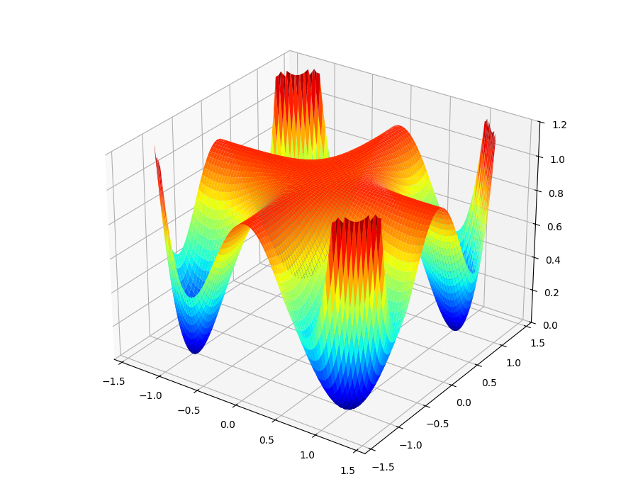
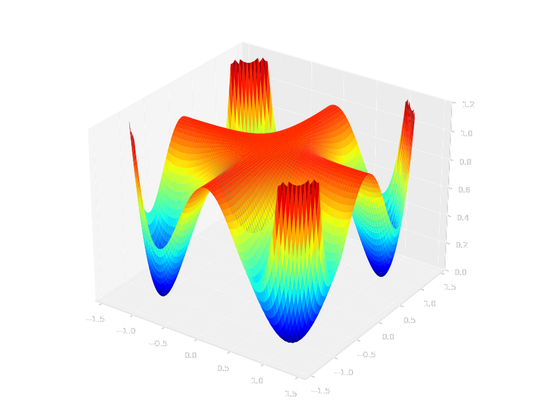
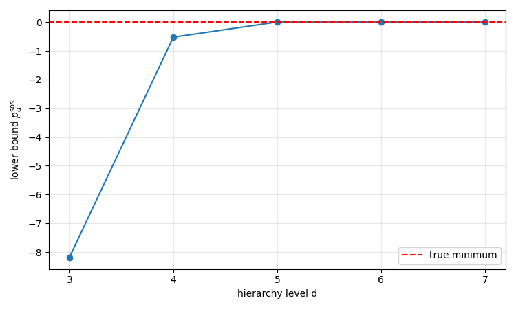
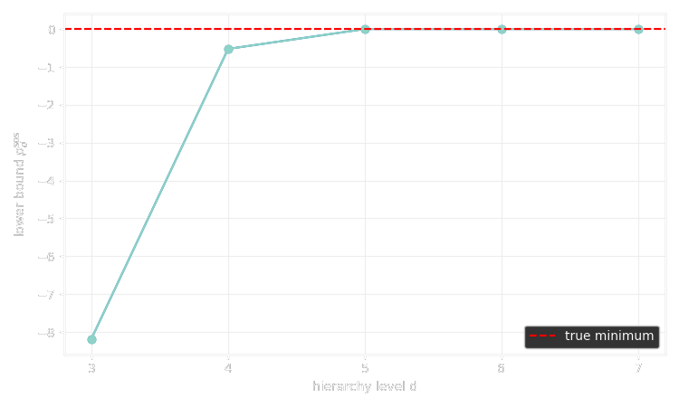

## Non-negativity and sums of squares

Let $\R[x]$ be the polynomial ring in variables $x = (x_1, \dots, x_n)$ with real coefficients.
We start with the following lead problem:
decide whether a given polynomial $p \in \R[x]$ defines
a globally non-negative function (in short, $p \geq 0$).
While we expect this to be very hard to solve in general,
we may consider some special cases of polynomials.

> **Example (Univariate case)**:
> Let $n = 1$ and assume that $p \in \R[x]$ is non-negative.
> Necessarily, we must have that $\deg(p) = 2d$ is even,
> and that the leading coefficient of $p$ is positive
> (we might as well take $p$ monic).
> We also note that any real root $p$ might have must appear with
> even multiplicity as $p$ otherwise flip sign there.
> Consider a factorization of $p$ into real roots and complex
> conjugate root pairs:
> $$\begin{aligned}
>   p(x) &= \prod_i (x - r_i)^{2 m_i}
>   \prod_j (x - z_j)^{n_j} (x - \overline{z_j})^{n_j} \\
>   &= \underbrace{\left(\prod_i (x - r_i)^{m_i} \prod_j (x - z_j)^{n_j}\right)}_{g(x)}
>      \underbrace{\left(\prod_i (x - r_i)^{m_i} \prod_j (x - \overline{z_j})^{n_j}\right).}_{\overline{g(x)}}
> \end{aligned}$$
> Thus, with $g(x) = u(x) + i v(x)$, we obtain the expression
> $p(x) = g(x) \overline{g(x)} = u(x)^2 + v(x)^2$.

We have proven that every non-negative univariate polynomial is a sum of
squares of other polynomials.
Of course the reverse, i.e. being a sum of squares, trivially implies non-negativity.
Is it possible that non-negativity can be characterized by the sum-of-squares
(or abbreviated, *sos*) criterion? Let's see another case.

> **Example (Quadratic case)**: We now let $n$ be arbitrary and pick
> $p \in \R[x]$ such that $p \geq 0$ and $\deg(p) = 2$.
> We may write $$ p(x) = x^T A x + b^T x + c, $$
> where $A$ is a symmetric $(n \times n)$-matrix, be an $n$-vector and $c$ a constant.
> First, observe that the non-negativity of $p$ implies that $A$ is positive semidefinite
> (or *psd* for brevity):
> indeed, if this were not the case, there would be a direction $u$ s.t. $u^T A u < 0$
> and thus $p(tu) = t^2 (u^T A u) + O(t) \to -\infty$ as $t \to \infty$.
> Next, consider the homogenization $\tilde{p}$ of $p$ in vectorized form:
> $$ \tilde{p}(x, t) = x^T A x + b^T x t + c t^2
> = \begin{bmatrix} x & t \end{bmatrix}
> \underbrace{\begin{bmatrix} A & \frac 12 b \\ \frac 12 b^T & c \end{bmatrix}}_{Q}
> \begin{bmatrix} x \\ t \end{bmatrix}.$$
> Note that $\tilde p (x, 0) = x^T A x \geq 0$ since $A$ is *psd* and
> $\tilde p (x, t) = t^2 p(x / t) \geq 0$  since $p \geq 0$ whenever $t \neq 0$,
> so that $\tilde p \geq 0$ globally on $\R^n \times \R$.
> It follows that its defining matrix $Q$ is *psd* itself and we may consider a
> [Cholesky factorization](https://en.wikipedia.org/wiki/Cholesky_decomposition)
> $Q = U^T U$ to find
> $$ p(x) = \tilde p(x, 1) = \left( U \begin{bmatrix} x \\ 1 \end{bmatrix} \right)^T
> \left( U \begin{bmatrix} x \\ 1 \end{bmatrix} \right) = \left\| U \begin{bmatrix} x \\ 1 \end{bmatrix} \right\|^2.$$
> This last expression for $p$ is again a sum of squares of affine functions.

As for the univariate case, it turns out that non-negativity and being a *sos* is
equivalent in case of quadratic polynomials as well.
This should provide enough motivation to introduce dedicated symbols.

> **Definition**:
> The set of non-negative polynomials and the set of *sos* polynomials will be
> denoted respectively by
> $ \NN_n = \set{p \in \R[x]}{p \geq 0} $
> and $\SOS_n = \set{\sum_i q_i^2}{q_i \in \R[x]}$.
> Their respective truncations at degree $2d$ are denoted by by
> $\NN_{n,2d}$ and $\SOS_{n,2d}$.
> The subscript $n$ may be dropped if the number of variables is clear from the context.

Both $\NN$ and $\SOS$ are [convex cones](https://en.wikipedia.org/wiki/Convex_cone):
they are closed under addition and multiplication by non-negative scalars and clearly
$\SOS \subseteq \NN$.
We have seen two families for which we even have equality - how far can we go with this?
Not much further unfortunately - a result which motivated [Problem 17](https://en.wikipedia.org/wiki/Hilbert%27s_seventeenth_problem) in Hilbert's 1900 list of 23 problems.

> **Theorem (Hilbert, 1888)**:
> The equality $\NN_{n,2d} = \SOS_{n,2d}$ holds if and only if $(n,2d)$ is either of 
> $(1,2d)$, $(n,2)$ or $(2,4)$.

In fact, the situation looks rather hopeless:

> **Theorem [(Blekherman, 2006)](https://doi.org/10.1007/BF02771790)**:
> Fix an even degree $d$ and let $H$ be the compact set of all $p \in \NN_{n,d}$
> such that $\int_{\mathbb{S}^{n-1}} p \, d\sigma = 1$.
> Then, as $n \to \infty$
> $$ \frac{\operatorname{vol}(\SOS_{n,d} \cap H)}{\operatorname{vol}(\NN_{n,d} \cap H)} \to 0. $$

The paper gives exact asymptotic rates (think $n^{-d}$; very fast), but the point is clear:
the density of $\SOS$ in $\NN$ is vanishingly small in many variables or high degree.
Nonetheless, *sos*-based methods have proven very practical for a wide variety of applications.
The next section will justify this claim.

## Automated proofs

Even though Hilbert proved that the equality $\NN = \SOS$ holds only in some special cases,
the first explicit counterexample was considered much later by Motzkin in 1967:
$$ M(x,y) = x^4 y^2 + x^2 y^4 - 3 x^2 y^2 + 1. $$
When plotted as a function on $\R^2$ its surface looks like this:

 

Proving that it is globally non-negative is a simple application of the
[AM-GM inequality](https://en.wikipedia.org/wiki/AM%E2%80%93GM_inequality):
$$ x^2 y^2 = \sqrt[3]{x^4 y^2 \; x^2 y^4 \; 1} \leq \frac{x^4 y^2 + x^2 y^4 + 1}{3}. $$
Rearranging yields $M \geq 0$.
The next result is the key to algorithmically deciding whether a given polynomial is *sos*.

> **Proposition (Parameterization of $\SOS$)**:
> Let $v_{n,d}(x) = (1, x_1, \dots, x_n, x_1^2, x_1 x_2, \dots, x_n^d)^T$
> be a monomial basis of the truncated polynomial ring $\R[x]_d$ written as column vector.
> A polynomial $p \in \R[x]_{2d}$ is *sos* if and only if there exists a
> *psd* matrix $Q$ such that
> $$ p(x) = v_{n,d}(x)^T Q v_{n,d}(x). $$

The exact choice of basis does not matter of course.
This matrix $Q$ will be refered to as the Gram matrix.

**Proof**:
If there exists such a $Q$ we may proceed as in the quadratic polynomial case above:
using a Cholesky factorization $Q = U^T U$ and plugging this in 
yields a sum-of-squares expression $p(x) = \| U v_{n,d}(x) \|^2$.
Conversely, if $p = \sum_i q_i^2$ is *sos*, we may write each $q_i$
(which is necessarily of degree at most $d$) in terms of the basis:
$q_i(x) = c_i^T v_{n,d}(x)$. Thus, $q_i(x)^2 = v_{n,d}(x)^T (c_i c_i^T) v_{n,d}(x)$
and by summing these up we get $p(x) = v_{n,d}(x)^T (\sum_i c_i c_i^T) v_{n,d}(x)$.
Finally, we observe that $Q = \sum_i c_i c_i^T$ is *psd* as a sum of rank-1 *psd* matrices.
$\square$

Checking whether the Motzkin polynomial $M(x,y)$ (or any polynomial for that matter)
is *sos* is therefore equivalent to checking whether the linear system
$$
  M(x,y) = v_{2,3}(x,y)^T Q v_{2,3} (x,y)
$$
obtained via coefficient matching has a *psd* solution $Q$.
In other words, it is equivalent to checking whether the intersection of an affine subspace
with the convex cone of *psd* matrices is non-empty.
A problem of this type can be solved in practice by
[semidefinite programming](https://en.wikipedia.org/wiki/Semidefinite_programming)
(short, *sdp*) solvers.
The experiment [`motzkin_not_sos.py`](https://github.com/lcwllmr/momsos/blob/main/code/momsos/experiments/motzkin_not_sos.py) computes exactly this - see the first of the two tests.

```
(.venv) $ motzkin-not-sos

Starting test: Is M(x,y) a sum of squares?  ...  Computation finished.
  Solution status: infeasible
  Solve time: 0.00112448s
  Iterations: 9

Starting test: Is (x^2 + y^2) * M(x,y) a sum of squares?  ...  Computation finished.
  Solution status: optimal
  Solve time: 0.005551222s
  Iterations: 12
```

This tells us that the the decomposition failed and that the Motzkin polynomial is not *sos*.
Some implementations of the so-called [interior point method](https://en.wikipedia.org/wiki/Interior-point_method) will also return a "dual infeasibility certificate":
To understand what that means exactly we need to study the conic dual of $\SOS$.
For now it is enough to think about such certificates as
a concrete hyperplane in some closely related cone that separates the compact feasible region
from the point of interest. More on this later.

So Motzkin is now verfiably not *sos*.
However, according to the second test that is performed in the experiment,
it turns out that the product of Motzkin with some other *sos* polynomial
results in something *sos*.
This is not just a coincidence.
Hilbert's result from the last section motivated a new question (which became Problem 17):
Is every non-negative polynomial a sum of squares of rational functions?
This has been answered positively by [(Artin, 1927)](https://doi.org/10.1007%2FBF02952513).
In our case, $M(x,y)$ is not *sos*, but it is fraction of two *sos* polynomials:
the denominator is $x^2 + y^2$ and the numerator was provided by the Gram matrix $Q$,
which was computed by the *sdp* solver.

In fact, one does not even have to guess the denominator as we did here.
The documentation of the Julia package [`SumsOfSquares.jl`](https://jump.dev/SumOfSquares.jl/stable/generated/Getting%20started/motzkin/) demonstrates how to build a program that not only
searches the decomposition of the product but also the denominator in one run given some
upper bound on the degree.
Let's rephrase this:
Any polynomial inequality can - in principle - be automatically proven or disproven
by means of semidefinite programming.
If it is true, then the *sdp* solver will provide a proof in the shape of a Gram matrix,
which is equivalent to an explicit *sos* decomposition, which in turn, proves non-negativity.
On the other hand, if the inequality is false, then the solver may return an infeasibility
certificate as we have seen before.

As powerful as this sounds, there are two important caveats.
For one, it is always important to be aware of possible issues with accuracy since
interior point methods are implemented using numerical linear algebra routines.
Moreover, the dimensions of such *sdps* explode very quickly if constructed naively.
The monomial vector $v_{n,d}(x)$, for instance, will have length $\binom{n + d}{n}$,
and an interior point solver itself will have rather high runtime costs being a
second-order method working on large matrices.
The research communities around these methods have found various tricks to circumvent cost
or trade it off with accuracy
(e.g. by exploiting more structure of problem instances or using more specialized solvers).


## Optimization over semialgebraic sets

In this section we will localize the non-negativity to sets described
by polynomial inequalities and formulate a effective procedure for solving
optimization problems over them.

Let $g_1(x), \dots, g_m(x) \in \R[x]$ be arbitrary polynomials and let them define
the basic semialgebraic set
$$
  K = \set{x \in \R^n}{g_1(x) \geq 0, \dots, g_m(x) \geq 0}.
$$
Such sets $K$ may take a wide variety of shapes. Here are just a few basic compact examples:

- closed unit ball: $g_1(x) = 1 - \| x \|^2$
- spherical shell: $g_1(x) = 2 - \| x \|^2$ and $g_2(x) = \| x \|^2 - 1$
- hypercube: $g_i (x) = 1 - x_i^2$ for $i = 1, \dots, n$
- simplex: $g_i(x) = x_i$ for $i = 1, \dots, n$ and $g_{n+1}(x) = 1 - \sum_{i=1}^n x_i$
- binary hypercube: $g_i(x) = x_i (x_i - 1)$ and $g_{n + i}(x) = -g_i (x)$ for $i = 1, \dots, n$

Note that this last example illustrates how to achieve equality constaints as well: simply add the negative of the polynomial to the mix.
We will assume throughout that $K$ is compact.

Next, consider a polynomial objective function $p \in \R[x]$ and consider the polynomial optimization problem (or *pop* for short)
$$ \pmin = \inf_{x \in K} p(x). $$

Problems of this rather innocent looking form encode a large variety of problems appearing in practice:
for starters, note that this already includes the whole classes of linear and quadratically constrained programming (themselves classes of broad application) as well as that of non-linear programming in binary variables which is of high interest to the field of combinatorial optimization.
Researchers have applied the method we are going to discuss in domains like power systems design, dynamical systems analysis, quantum information theory and to find sharp approximations to many famous NP-hard problems like [MaxCut](https://en.wikipedia.org/wiki/Maximum_cut) or [StableSet](https://en.wikipedia.org/wiki/Maximal_independent_set).

While *pops* are hard, non-convex problems in general, we can reformulate them into a convex problem (albeit an infinite dimensional one) by using the language of non-negativity.
Define the new convex cone $\NN(K) = \set{p \in \R[x]}{p(x) \geq 0 \; \forall x \in K}$
(exercise: verify that this is really a convex cone).
With it, reformulate
$$ \pmin = \sup \set{\lambda \in \R}{p - \lambda \in \NN(K)}. $$
Indeed, let $x^* \in K$ be a minimizer in the first formulation (remember: $K$ was assumed to be compact) and $\lambda^*$ be the maximizer of the second formulation.
Then, the polynomial $p - \lambda^*$ is non-negative on $K$.
If $p(x^*) - \lambda^*$ were strictly positive on $K$, it would contradict the optimality of $\lambda^*$, and therefore $\pmin = p(x^*) = \lambda^*$.

How lucky for us, that we already know very well how to relax non-negativity - let's go back to sums of squares.

> **Definition**: The quadratic module associated to the polynomials $g_1, \dots, g_m$ is defined as
> $$ Q(g_1, \dots, g_m) = \set{\sigma_0 + \sum_{j = 1}^{m} \sigma_j g_j }{\sigma_0, \sigma_1 \dots, \sigma_m \in \SOS}. $$
> For a given degree $2d$ we also define the truncated quadratic module
> $$ Q(g_1, \dots, g_m)_{2d} = \set{p \in Q(g_1, \dots, g_m)}{\deg(p) \leq 2d}. $$

The purpose is clear: any $p \in Q(g_1, \dots, g_m)$ is non-negative on $K$ since $g_i(x) \geq 0$ on $K$ for all $i = 1, \dots, m$.
Thus, similar to how $\SOS$ relaxes $\NN$, the new convex cone $Q(g_1, \dots, g_m)$ relaxes $\NN(K)$.

Note that membership in the truncated quadratic module will only certify non-negativity on $K$ if all of the summands appear. The truncation degree $2d$ must be chosen to be greater or equal $\max(\deg(g_1), \dots, \deg(g_m))$.

Moreover, observe that we declared explicit dependence on the defining inequalities instead of $K$ itself.
Different descriptions may result in different quadratic modules, but we can only write down an effective certificate if we know a description.

Now we are ready to define the sums-of-squares hierarchy:
$$ \psos_d = \sup \set{\lambda \in \R}{p - \lambda \in Q(g_1, \dots, g_m)_{2d}}. $$
These define a sequence of convex, finite-dimensional optimization problems.
As we increase the hierarchy level $d$, the search space grows and we find ourselves in a chain of inequalities
$$ \psos_d \leq \psos_{d + 1} \leq \pmin. $$

The first immediate question is: will this converge? That is, will $\psos_d \to \pmin$ as $d \to \infty$? Lucky us again:

> **Theorem (Putinar's Positivstellensatz, 1993)**:
> Assume that $K$ is compact and the quadratic module $Q = Q(g_1, \dots, g_m)$ is Archimedean, i.e. if $R - \|x\|^2 \in Q$ for some $R > 0$.
> If $p \in \NN(K)$, then $p + \varepsilon \in Q$ for all $\varepsilon > 0$.

The word Positivstellensatz was chosen in analogy to the German Nullstellensatz in algebraic geometry.
A constructive and elementary proof of this result can be found in [(Schweighofer, 2005)](https://doi.org/10.1137/S1052623403431779).

Let us first have a look at the Archimedean condition, which is a technical assumption only and closely related to the discussion above: the quadratic module depends on the description of the set and not the set itself.
All it says is that you need to have such a ball constraint in the module for guaranteed convergence.
Practically, this is not a deal-breaker.
If you already know (maybe approximately) diameter and location of $K$, or if you have an a-priori bound on where the minimizers should be, it is enough to add this inequality without changing anything.

So how does this help us?
Think of $\varepsilon$ as the sharpness of the bound.
For any desired sharpness, Putinar tells us that we will be able to decompose a polynomial $p - \lambda$ into the form required for membership in the quadratic module as long as we are willing to wiggle $\lambda$ by $\varepsilon$.
Therefore, as we go up in hierarchy level, i.e. in truncation degree, we will be able to tighten our bounds, i.e. to let $\varepsilon \to 0$, because we gradually enlarge the search space.
This proves asymptotic convergence of the *sos* hierarchy.

Since we did not leave the framework of the last section, we are again able to use semidefinite programming to solve such optimization problems.
Let's take again the Motzkin polynomial $M(x,y)$ from the previous section and try to minimize it on a non-centered ball.
In other words, we attempt to solve the problem
of maximizing a scalar $\lambda$ such that the linear coefficient matching system 
$$M(x,y) + \lambda = \sigma_0 + \sigma_1 (r^2 - (x - x_0)^2 - (y - y_0)^2)$$
is satisfied and such that the the two polynomials $\sigma_0$ and $\sigma_1$ are *sos*, i.e. can be described by two *psd* matrix variables.
Before, we were dealing only with feasibility and now we also need to optimize a linear function at the same time.
Also, note that the first hierarchy level that makes sense here is $d=3$ - anything below and the coefficient matching system would be over-determined.
This problem is implemented in the experiment [`motzkin_minimize.py`](https://github.com/lcwllmr/momsos/blob/main/code/momsos/experiments/motzkin_minimize.py); check out the code to see how to hand these data to a solver.
Here is the result:

 

This is converging to the minimum (or rather to numerical precision) quite fast.
Is the Archimedean condition satisfied here?

## Duality

As so often in mathematics, taking a closer look at the dual of a given problem/concept/space/... can be very fruitful.
In this section we are going to examine exactly the same problem, i.e.
the polynomial optimization problem
$$\pmin = \inf_{x \in K} p(x)$$
for the compact semialgebraic set $K = \{g_1 \geq 0, \dots, g_m \geq 0\}$ but we choose a different road to arrive at the hierarchies of lower bounds.
This will lead us naturally to the dual theory of moments.

Consider the following reformulation:
Let us denote by $\operatorname{Prob}(K)$ the convex (!) set of all probability measures supported on $K$ (all mass lies inside $K$ or equivalently the measure of $X \setminus K$ is zero for any $X \subseteq \R^n$).
Then,
$$\pmin = \inf_{\mu \in \operatorname{Prob}(K)} \int p(x) \, d\mu(x).$$
At first glance, this might seem a bit strange but let us quickly verify that this is in fact true:

- "$\leq$": By definition $\pmin \leq p(x)$ for any $x$. Thus, if $\mu \in \operatorname{Prop}(K)$ we have $\pmin = \int \pmin \, d\mu(x) \leq \int p(x) \, d\mu(x). $
- "$\geq$": Let $x_0 \in K$ and denote by $\delta_{x_0}$ the Dirac delta at that point (mass 1 on any set that contains it and 0 otherwise). Then, $p(x_0) = \int p(x) \, d\delta_{x_0}$ meaning that the integral may assume any value that $p$ can, so is at most $\pmin$.

The language that we are going to use for these two last sections will be introduced now for yet another reformulation of this integral expression.

> **Definition**:
> The **moment cone** $\MOM$ is the set of all linear functionals $L \colon \R[x] \to \R$ on the polynomial ring for which there is a measure $\mu$ such that
> $$L(p) = \int p(x) \, d\mu(x).$$
> Similarly, for a set $K \subseteq \R^n$ we define the **localized moment cone** $\MOM(K)$ as the set of all linear functions on $\R[x]$ that are integration w.r.t. a measure supported on $K$.

Note that we did not require these measures to be probability measures.
The reason is that $\MOM$ would fail to be a cone if we did (verify this for yourself!).
That said, if $L$ is such a functional then requiring it to be integration w.r.t. to some probability measure is as simple as enforcing $L(1) = 1$.

In this notation, we may write
$$\pmin = \inf\set{L(p)}{L \in \MOM(K), L(1) = 1}.$$

We present now the key theorem that establishes duality.
Let us denote the dual of a vector space $V$ by $V^*$.
If $C \subseteq V$ is any cone inside $V$ then we define the **dual cone** as $C^* = \set{L \in V^*}{L(c) \geq 0\;\forall c \in C}$.

> **Theorem (Haviland, 1936)**:
> If $K \subset \R^n$ is a closed subset, then the moment is the dual of the cone of non-negative polynomials, i.e.
> $$\MOM(K) = \left(\NN(K)\right)^* = \set{L \in \R[x]^*}{L(p) \geq 0\;\forall p \in \NN(K)}.$$

Functionals that preserve positivity like this one are sometimes called *positive functionals*.
One direction is quite simple: if $L$ is integration w.r.t. to some measure, then one verifies immediately that non-negative polynomials map to non-negative values.
The other direction is a bit more involved; here is the outline:
First, extend to positive functionals on the space of smooth functions that grow at most polynomially.
There, apply the measure-theoretic variant of Riesz' representation theorem for the space of compactly supported functions (as presented for instance in [(Folland, 1999)](https://www.wiley.com/en-us/Real+Analysis%3A+Modern+Techniques+and+Their+Applications%2C+2nd+Edition-p-9781118626399)) to assert the existence of a measure.
Lastly, show that the representation still holds for smooth polynomially growing functions - in particular for polynomials themselves.
The detailed proof can be found in Section 4.6 of [(Laurent, 2010)](https://homepages.cwi.nl/~monique/files/moment-ima-update-new.pdf).
Note also that the assumption is that $K$ is merely closed.
For our purposes it would be enough to show the theorem in the compact case.

Now, that we have established duality with the cone of non-negative polynomials, we also realize that testing membership is at least as hard as for $\NN$.
We will therefore introduce a relaxation as the dual to the sums of squares cone and quadratic modules:

> **Definition**:
> The **pseudo-moment cone** $\PMOM$ is defined as the conic dual to $\SOS$, i.e.
> $$\PMOM = \SOS^* = \set{L \in \R[x]^*}{L(\sigma) \geq 0 \; \forall \sigma \in \SOS}.$$
> Analogously, for polynomials $g_1, \dots, g_n \in \R[x]$ defining a basic semialgebraic set $K = \{g_1 \geq 0, \dots, g_m \geq 0\}$ we define the **localized pseudo-moment cone** as
> $$\PMOM(g_1, \dots, g_m) = Q(g_1, \dots, g_m)^* = \set{L \in \R[x]^*}{L(q) \geq 0 \; \forall q \in Q(g_1, \dots, g_m)}.$$

The prefix "pseudo" is justified:
while the *sos* cone $\SOS \subset \NN$ was an inner approximation, we are now in the situation of an outer approximation $\PMOM \supset \MOM$, i.e. not all pseudo-moments come from a measure.
Indeed, being positive on all *sos* polynomials is a more inclusive condition than being non-negative.
Moreover, as we will detail in the next section, membership is again tractable in the sense of semidefinite programming.

As before, we now have all the ingredients together to define the dual lower bound on $\pmin$:
$$\pmom = \inf\set{L(p))}{L \in \PMOM(g_1, \dots, g_m), L(1) = 1} \leq \pmin.$$
This is a lower bound simply because we enlarge the feasible set.

> **Warning**:
> Both the inner approximation in the *sos* case and the outer approximation in the moment case led to lower bounds.
> Keep in mind that the former used a little trick which transformed the problem into maximization, while the moment side stayed a minimization problem.
> For this reason, the *sos* side is usually referred to in the literature as the dual and the moment side as the primal - this is somewhat opposite to the flow of this introduction to the Moment-SOS hierarchy.
> Have a look at one of the original expositions in $[(Lasserre, 2001)](https://doi.org/10.1137/S1052623400366802)$ to verify this yourself.

We may also introduce the respective truncated (pseudo-)moment cones $\MOM_{2d}$, $\PMOM_{2d}$, $\MOM(K)_{2d}$ and $\PMOM(g_1, \dots, g_m)_{2d}$ in the expected way:
Instead of considering functionals on the whole polynomial ring, we only look at $\R[x]_{2d}$.
This leads then to the (completely analogous) hierarchy of finite-dimensional convex optimization problems
$$\pmom_{d} = \inf\set{L(p))}{L \in \PMOM(g_1, \dots, g_m)_{2d}, L(1) = 1}$$
with the chain of inequalities $\pmom_{d} \leq \pmom_{d + 1} \leq \dots \leq \pmom \leq \pmin$.
It should not come as a surprise now that both bounds $\psos_{2d}$ and $\pmom_{2d}$ are tightly linked:

> **Proposition (Weak duality)**: For $d$ large enough (for the optimization problem to be well-defined) we have $\psos_d \leq \pmom_d$ and $\psos \leq \pmom$.

**Proof**:
Let $\lambda$ be a feasible solution for the optimization problem $\psos$:
there exists some $q \in Q(g_1, \dots, g_m)$ such that $p - \lambda = q$.
If $L$ is any feasible solution for the optimization problem $\pmom$ (i.e. $L$ is non-negative on the quadratic module generated by $g_1, \dots, g_m$), then in particular
$$L(p) - \lambda = L(p) - \lambda L(1) = L(p - \lambda) = L(q) \geq 0.$$
Thus, $\lambda \leq L(p)$.
Because the feasible solutions from both problems were arbitrary, the inequality holds for the optima due to closedness. $\square$

Under certain conditions, often encountered in practice, the two problems are also *strongly* dual (i.e. $\psos = \pmom$).
One such sufficient condition is that the semialgebraic set $K \subseteq \R^n$ has non-empty interior (see Theorem 6.1 in  [(Laurent, 2010)](https://homepages.cwi.nl/~monique/files/moment-ima-update-new.pdf)).

The weak duality result has a strong consequence:
Recall that Putinar's Positivstellensatz established that $\pmin = \psos$ in case of compact $K$ with Archimedean description.
Since $\pmin = \psos \leq \pmom \leq \pmin$, it also shows asymptotic convergence of the moment hierarchy in that case.

## Moment matrices and optimizers

The purpose of this final section is to show how to pass the data of the moment relaxation at some degree truncation to a solver.
Afterwards, we answer an important question: how can we possibly know at which degree $d$ we can stop going up in the hierarchy?
Under such circumstances it will also be possible to use the solver outputs to extract concrete minimizers.

First, let us show that the levels of the moment hierarchy are again semidefinite programs.
In the following proposition we may easily replace the infinite localized pseudo-moment cone by a truncation with the same result.

> **Proposition**:
> Extend the description of the semialgebraic set by the constant polynomial $g_0 = 1$ (this does not change the set as trivially $1 \geq 0$).
> To a linear functional $L \in \R[x]^*$ and for each $j = 0, 1, \dots, m$ we associate the bilinear form
> $$B^L_j \colon \R[x] \times \R[x] \to \R, \quad (p_1, p_2) \mapsto L(g_j p_1 p_2).$$
> Then, a functional $L \in \R[x]^*$ is a member of the localized pseudo-moment cone if and only if all associated bilinear forms $B^L_j$ are *psd* ($j = 0, 1, \dots, m$).

This is the analogon to the positive semidefinite description of the *sos* cone and of the truncated module.

**Proof:**
If $L \in \PMOM(g_1, \dots, g_m)$ then it is non-negative on the truncated module.
In particular, it is non-negative on each polynomial of the form $g_j h^2$ (choose the zero polynomial for all other terms of a generic member of the quadratic module).
But then $B^L_j (p, p) \geq 0$ for any polynomial $p \in \R[x]$, so $B^L_j$ is *psd*.
Conversely, let $L \in \R[x]^*$ be a linear functional such that all bilinear forms $B^L_j$ are *psd*.
Let $q = g_0 p_0^2 + g_1 p_1 ^2 + \dots + g_m p_m^2$ be an arbitrary element of the quadratic module.
Thus, 
$$L(q) = B^L_0 (p_0, p_0) + B^L_1(p_1, p_1) + \dots + B^L_m (p_m, p_m) \geq 0,$$
so $L$ is a localized pseudo-moment functional.
$\square$

Let us now pass to the truncated case.
Here, of course we would like to talk about concrete matrices instead of bilinear forms or functionals so that we can pass them numerically to a solver.
We will need to choose a basis.
For simplicity, and because it is standard we will again choose the monomial basis truncated at some degree $2d$.
For the polynomial ring in $n$ variables $x = (x_1, \dots, x_n)$, the (unsorted) monomial basis in multi-index notation is
$$ \set{x^\alpha}{\alpha \in \Z_{\geq 0}^n,\; |\alpha| \leq 2d}. $$

Note that any functional $L \in \left(\R[x]_{2d}\right)^*$ on the truncated polynomial ring evaluated at a polynomial $h$ can be expressed as
$$L(h) = L_y(h) = \sum_{|\alpha| \leq 2d} y_\alpha h_\alpha = y^T h, $$
where $h_\alpha$ is the corresponding coefficient of $h$ and $y$ is now a vector of size equal to that of the basis.
In the last expression, we simply interpret $h$ as a vector in the monomial basis as a shorthand notation.
Thus, we will from now on speak about (pseudo-)moment vectors $y$ instead of (pseudo-)moment functionals $L$.

In the literature the following notation for the matrices of bilinear forms from the last proposition is very common.
Starting with $j = 0$, i.e. for the trivial addition $g_0 = 1$, the **moment matrix** corresponding to the bilinear form $B^L_0$ associated to $L_y$ is defined as the matrix $M_d(y)$ with entries indexed by multi-indices $|\alpha|, |\beta| \leq d$
$$M_d(y)_{\alpha, \beta} = L_y(x^\alpha x^\beta) = y_{\alpha + \beta}.$$

This might seem a bit strange at first glance; it's always good to see an example.
Let's consider the case $n = 2$ and $d = 2$.
Let $y$ be a moment vector with one entry for each monomial in two variables up to degree $2d = 4$.
Then, the associated moment matrix is
$$
M_2(y) = \left[\begin{array}{c:cc:ccc}
y_{00} & y_{10} & y_{01} & y_{20} & y_{11} & y_{02} \\ \hdashline
y_{10} & y_{20} & y_{11} & y_{30} & y_{21} & y_{12} \\
y_{01} & y_{11} & y_{02} & y_{21} & y_{12} & y_{03} \\ \hdashline
y_{20} & y_{30} & y_{21} & y_{40} & y_{31} & y_{22} \\
y_{11} & y_{21} & y_{12} & y_{31} & y_{22} & y_{13} \\
y_{02} & y_{12} & y_{03} & y_{22} & y_{13} & y_{04}
\end{array}\right].
$$

Note that you can find $M_1(y)$ for $n = 3$ as the upper left $(3 \times 3)$-submatrix.
It's a good exercise to write out a moment matrix like this for yourself
(e.g. try the case $n = 3$ and $d = 1$).

For $j > 0$, we need to shift and add monomials according to the vector $g_j$.
For multi-indices $|\alpha|, |\beta| \leq d$ we define the localizing (moment) matrix
$$M_d(g_j y) = L_y (g_j x^\alpha x^\beta) = \sum_{\gamma} \left( g_j \right)_\gamma y_{\alpha + \beta + \gamma}.$$
As an example, let us consider a centered ball constraint (those that are required by Putinar's theorem) with $n = 2$ and $d = 1$, 
so $g_1(x) = 4 - \|x\|^2 = 2 - x_1^2 - x_2^2$.
Under this setup the localizing matrix is
$$
M_1(g_1 y) = \left[\begin{array}{c:cc}
4 y_{00} - y_{20} - y_{02}  &  4 y_{10} - y_{30} - y_{12}  &  4 y_{01} - y_{21} - y_{03} \\ \hdashline
4 y_{10} - y_{30} - y_{12}  &  4 y_{20} - y_{40} - y_{22}  &  4 y_{11} - y_{31} - y_{13} \\
4 y_{01} - y_{21} - y_{03}  &  4 y_{11} - y_{31} - y_{13}  &  4 y_{02} - y_{22} - y_{04} \\
\end{array}\right].
$$
This is exactly the moment matrix $M_1(y)$ in which each entry is scaled and shifted by the coefficients and exponents of the constaint.

In this new matrix notation we can reformulate $\pmom$ into a version that can be passed to solvers.
Let's make this a bit more explicit than previously to figure out which degrees we really need (compare to the degree constraints on the individual terms of the quadratic module).
Write
$$d_0 = \left\lceil \frac{\deg g_0}{2}\right\rceil = 1, d_1 = \left\lceil \frac{\deg g_1}{2} \right\rceil, \dots, d_m = \left\lceil \frac{\deg g_m}{2} \right\rceil $$
to denote the rounded up half-degrees of all polynomials that define the semialgebraic set $K$.
Then, the minimum degree for a moment (or *sos*) relaxation to make sense will denoted by $d_{\text{min}} = \max\{ \lceil\deg p/2 \rceil, d_0, d_1, \dots, d_m \}.$
Then, for any hierarchy level $d \geq d_{\text{min}}$ and letting $N = \dim \R[x]_{2d}$, we arrive at our final formulation
$$\pmom_d = \inf\set{y^T p}{y \in \R^N, y_0 = 1, M_{d - d_j}(g_j y) \succeq 0, j = 0, \dots, m },$$
where we used the shorthand $A \succeq 0$ for a matrix to be *psd*.
Note that $M_{d - d_0}(g_0 y) = M_d (y)$.
This is now precise enough to be passed to a solver.
Check out the first part of the code for the experiment [`motzkin_moment.py`](https://github.com/lcwllmr/momsos/blob/main/code/momsos/experiments/motzkin_moment.py) to see this in action.

We finish this introduction with a short discussion of the question: at which degree $d$ can I stop going up in the hierarchy? When have I reached the optimum?
This is a very relevant question as the dimension of $\R[x]_{2d}$ (and with it the size of our moment matrices) grow rapidly leading to numerical difficulty.
See Sections 6.6 and 6.7 in [(Laurent, 2010)](https://homepages.cwi.nl/~monique/files/moment-ima-update-new.pdf)) for a detailed discussion.

Here is a first simple criterion.
Denote by $e_1, \dots, e_n$ the multi-indices corresponding to the monomials $x_1, \dots, x_n$.

> **Proposition**:
> Let $y$ be an optimal solution for the problem $\pmom_d$.
> Define $\overline{x} = (y_{e_1}, \dots, y_{e_n}) \in \R^n$.
> If $\overline x \in K$ and $p(\overline x) = \pmom_d$, then $\pmin = \pmom_d$ and $\overline x$ is a minimizer to the original problem, i.e. $p(\overline x) = \pmin$.

Here is some intuition for this result.
If $y$ were given by integration w.r.t. a probability measure $\mu$, then one could think of $\mu$ as being concentrated tightly around a true minimizer (close to a Dirac at that point), so that the moments $y_{e_i} = \int x_i \, d\mu(x)$ are large only if and only if $x_i$ is close to the true $i$-th coordinate of the minimizer.

**Proof**:
Since $\overline x \in K$, we certainly have $\pmin \leq p(\overline x)$.
But by assumption we also have $p(\overline x) = \pmom_d \leq \pmin$ since the hierarchy produces lower bounds.
$\square$

While this is generally a rare situation to be in, there are heuristic arguments to be made that this has a good chance of being true in case of a unique global minimizer to the original problem (cf. the sections of the survey mentioned above).
We perform this test in the experiment
[`motzkin_moment.py`](https://github.com/lcwllmr/momsos/blob/main/code/momsos/experiments/motzkin_moment.py).
As before we attempt to minimize the Motzkin polynomial around a small ball around one of the minimal points at $(1, -1)$ with value $0$.
At each hierarchy level we log the found lower bound and check numerically if the criteria for the last proposition are satisfied.
Here is the result on my system:

```
$ motzkin-moment

hierarchy level d = 6
  -> solver status: optimal
  -> pmom_6 = -1.0611336720423026e-06
  -> xbar = [0.9300696568198683, -0.923372680505846]
  -> constraint value g1(xbar): 0.0507619989901501 (feasible)
  -> |p(xbar) - pmom_6| = 0.05421546272582045
hierarchy level d = 7
  -> solver status: optimal
  -> pmom_7 = 1.7405777708034975e-08
  -> xbar = [0.9193142154224452, -0.9144839411955861]
  -> constraint value g1(xbar): 0.053823192146335685 (feasible)
  -> |p(xbar) - pmom_7| = 0.0680625302440645
hierarchy level d = 8
  -> solver status: optimal
  -> pmom_8 = 2.7041787764581215e-07
  -> xbar = [0.9400211494212625, -0.9412264389430985]
  -> constraint value g1(xbar): 0.04705179399605586 (feasible)
  -> |p(xbar) - pmom_8| = 0.03677300078418422
hierarchy level d = 9
  -> solver status: optimal
  -> pmom_9 = 3.097746410496427e-07
  -> xbar = [0.9636166109044235, -0.9623476028476482]
  -> constraint value g1(xbar): 0.04274145401339868 (feasible)
  -> |p(xbar) - pmom_9| = 0.015074659455620143
hierarchy level d = 10
  -> solver status: optimal
  -> pmom_10 = 1.2811140037705115e-07
  -> xbar = [0.9690466266312561, -0.9692733473958901]
  -> constraint value g1(xbar): 0.04190223850315855 (feasible)
  -> |p(xbar) - pmom_10| = 0.010615989938524306
hierarchy level d = 11
  -> solver status: optimal
  -> pmom_11 = 3.0463441458294938e-06
  -> xbar = [0.8830502005680481, -0.8842745049144566]
  -> constraint value g1(xbar): 0.06706964579996799 (feasible)
  -> |p(xbar) - pmom_11| = 0.12301890909944158
hierarchy level d = 12
  -> solver status: optimal
  -> pmom_12 = 8.13755707262942e-07
  -> xbar = [0.956053920985409, -0.9587413539555535]
  -> constraint value g1(xbar): 0.043633533734177554 (feasible)
  -> |p(xbar) - pmom_12| = 0.019707880115166
hierarchy level d = 13
  -> solver status: optimal
  -> pmom_13 = 8.671382947245121e-07
  -> xbar = [0.97056788804639, -0.9704954375080612]
  -> constraint value g1(xbar): 0.04173676842189067 (feasible)
  -> |p(xbar) - pmom_13| = 0.009723313378852128
```

As it turns out, we do indeed approach the true (and unique!) minimizer but we do so very, very slowly.
Note that although the lower bound already hits numerical precision, we cannot apply the result yet.
Intuitively, increasing the hierarchy level brings the pseudo-moment vector closer to the true infinite moment vector of the optimal measure, but we need a lot more information to produce minimizers than to get tight lower bounds.

There is a more general theorem which includes this strategy as a special case and but with broader applicability.
Loosely speaking, one is able to extract minimizers if the sequence of ranks of the moment matrices in the hierarchy level stabilizes.

> **Theorem (Rank stabilization)**:
> Let $d_K = \max\{ d_0, \dots, d_m \}$ be the maximum rounded up half-degree of the polynomials that define $K$.
> For $d \geq d_{\text{min}}$ let $y$ be an optimal solution to $\pmom_d$.
> Assume that there is some $s$ with $d_{\text{min}} \leq s \leq d$ for which 
> $$r = \rank M_{s}(y) = \rank M_{s - d_K} (y).$$
> In this case, the associated functional $L_y$ is integration w.r.t. an $r$-*atomic* probability measure
> $$\mu = \sum_{i=1}^r \lambda_i \delta_{x^i}, $$
> which is convex combination of Dirac deltas.
> Moreover, the points $x^i \in K$ are global minimizers to the *pop*, i.e. $p(x^i) = \pmin$.

Without going into detail, it is possible to extract the minimizers from such a setting by means of numerical linear algebra.

These results highlight the advantages of considering both the *sos* and the moment side of the hierarchy:
We've seen that the *sos* side gives us algebraic proofs for a given bound by producing an explicit element of the quadratic module.
The moment side on the other hand is closer in nature to distributions on the set $K$ itself and as such might give us access to stopping criteria and concrete minimizers.
